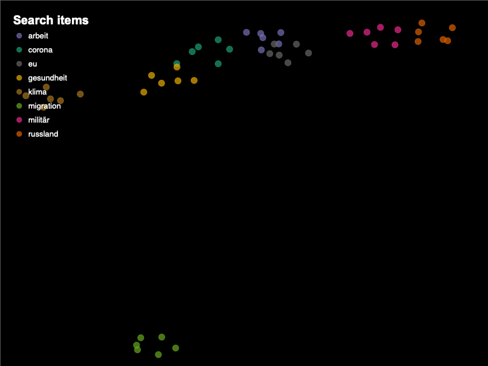

## Selected projects in data science, machine learning, statistics and NLP

- Time series are strange phenomena due to their autoregressive nature. You cannot say that a sine-like or random-walk time series (like stocks) are "equal". What else can you find out about time series? 

- The aim of this study is to investigate whether different types of time series can be distinguished into chaotic and noisy time series with "Simplex" of EDM. Artificial time series (sine and sine with noise), human-generated time series (Financial Stress Index) and the Bitcoin share are examined serially.

- For practical use, this approach is a type of analysis that can be used to determine the predictive power of a time series by itself.

[View on google colab](https://colab.research.google.com/drive/1N2jHDRhqBYR9Il3O0C1CKqBP7rakkeWn?usp=sharing)

---

### Analyzing time series with linear and dynamic methods 

- Linear models that were used: VAR, Granger Causylity, Impulse Response and Forecast Error Variance Decomposition
  
- Dynamic methods that were used: Convergent Cross Mapping (CCM) which is a part of Empirical Danymic Modeling (EDM).
  
- CCM is a new method that is non-linear and can be used as a dynamic "causality analysis" that works without assumptions.
  
- The question of whether the FED's interest rate behavior can have an influence on the Dow Jones was clarified.

[View on google colab](https://colab.research.google.com/drive/1TNXHsmf3MI1mYiLb_098daBcAxbISvpd?usp=sharing)

---

### Forecast bitcoin - Multioutput with Regressorchain and LightGBM.

- Multivariate multioutput modelling with LightGBM and RegressorChain
  
- Baseline with VAR
  
- Hyperparatersearch with BayesOpt
  
- Featureimportance
  
- This model can forecast 15 days of the bitcoin stock

[View on google colab](https://colab.research.google.com/drive/1DgBxUSYDBiZyVNItglVpMK3Fb0oKvibl?usp=sharing)

---

### Deep Learning - Stock Market Forecasting with LSTM

- Univariate modelling

- Feature Engineering: 100 timesteps to predict 1 day

- LSTM Stack with hyperparameter to get the best forecasting

[View on google colab](https://colab.research.google.com/drive/10bwEab00XRrGvSTvlt4EoUt5xlGiYlhu?usp=sharing)

---
---

### Deep Learning - Anomaly Detection using Autoencoder

- Autoencoders are fascinating because they can be used to create a "numerical mapping" of an entity.

- In the process, the dimensions per hidden layer are reduced (encoder).

- The hidden layer with the smallest dimension is the so-called "bottleneck".

- Then the dimensions are increased again (decoder).

- The target is the input itself, so the decoder is forced to "reconstruct" the entity. 

- This can be seen as a kind of non-linear PCA with NN.

- The popular way to solve a problem with autoencoders is: 

    - Another entity has a different reconstruction loss so that other entities can be recognised. Especially with a very unbalanced data set, this may be the only possibility.
    
    - Based on the different distributions of the different entities, one can, for example, draw a threshold to automate a decision.
 
    - In this case, the reconstruction loss of fraud and non-fraud data is plotted to draw a decision boundary.

[View on google colab](https://colab.research.google.com/drive/1x_fVRtSW3Q1N45eiYPCrGWRVJeN-GC2J?usp=sharing)

---
---

### Interpretation - Detect the reasons of attrition

- The interpretation of the features of a simple decision tree.

- Checking the results with a strong black box model: XGBoost
  
- Hyperparameteroptimization with Hypteropt, Permutation Feature Importance and deleting unimportant features.

- Interpretation of the black box modell with agnostic methods like: Partial dependence plots

- This notebook will demonstrate that Data Science or Machine Learning is not just about chasing the best prediction, but can also be used to understand feature-feature or feature-target relationships more deeply in order to provide concrete hand-on guidance and understanding.  

[View on google colab](https://colab.research.google.com/drive/107sR_fGWCfF5Z1q-xkUQMO6JI9bTv2KL?usp=sharing/)

---
---

### Research - Perceptions of Income Inequality in Europe - The equity assessment of one's income based on individual, firm, structural and macro factors.

- I sought to demonstrate whether the results of Sauter et al. (2016) are generalizable to the level of Europe: 
Sauter found for Germany that income inequities are legitimate when they are based on individual factors. Operational or structural factors have a significant impact on whether one's income was perceived as fair or unfair. 

- I found: It is not possible to generalize the results of Sauter et al. to the level of Europe. 

[Read online](https://www.janoschkorell.eu/wp-content/uploads/2023/04/Perzeptionen-von-Einkommensungleichheiten-in-Europa.pdf)

---
---

### NLP - Fine-tune pre-trained Longformer for classification party speeches

- Framework: Pytorch Lightning

- In a previous script, the longformer was trained on the German language and the type of language used in political speeches of the German parliament. 

- Now the fine-tuning takes place with the corresponding labels of the parties. 

- With the help of the Longformer it is possible to process an input of 4096 tokens, which breaks the limitations of other Bert models. 

-  The training takes a very long time and requires a GPU with a lot of RAM. So far, 111 epochs have been trained, each requiring 1.5 hours. You can examine the results so far under "6. test".

[View on google colab](https://colab.research.google.com/drive/1dfgr4Wbd9Pp-vh1nvWShdO0KL8cYYHcY?usp=sharing/)

---
---

### NLP - Pre-train Longformer with masked language modelling on german party speeches

- Framework: Huggingface/Pytorch

- For long texts the Longformer is a suitable choice, because it can process 4096 inputs of tokens. 
The goal: The Longformer should be trained with speeches of politicians from the Bundestag, so that the 
German language and the peculiarity of the language of the speeches are learned.

- Since the Longformer is based on RoBerta, the ByteLevel Tokenizer or RoBerta Tokenizer is used. 

- 15% of the texts are masked and completely given into the model. 

- The model was trained with about 35 epochs, a batch size of 4 and a learning rate of 0.00001 and 0.000001. 
A higher batch size leads to an overload of the working memory of the GPU.

- One can see that the word 'colleague' is correctly predicted with almost 100%. Some words are not predicted correctly, 
but the sense and grammar is correct. 

- The model was trained on a A100 80G GPU.

So,the language model works!

[View on google colab](https://colab.research.google.com/drive/1q0vrNHLWiyP3GUxb0Yv8wfzHmTyMjR4E?usp=sharing/)

---

---

### NLP - Classification with tf-idf and interpretation with lime 

In this script, I search for the best model for prediction and configure the lime explainer for texts

- The data was collected in-house and a sample of the party speeches was created.
- The data were cleaned.
- Calculate tf-idf features
- Check out many models for the best prediction
- Check flase classifications
- Interprete the predictions with lime explainer

[View on google colab](https://colab.research.google.com/drive/1OscdJQUFy9wokk653kCae02xTSxWN3aa?usp=sharing/)

---

---

### NLP - Doc2Vec, Evaluation, Classification. Also Classification text with CNN.

In this script, I classified with the help of Doc2Vec. A possibility to vectorise documents of any length. 

- The data was collected in-house and a sample of the party speeches was created.
- The data were cleaned.
- Doc2Vec was made possible with the help of Gensim. Both DBOW and DM were calculated.
- Evaluation of Doc2Vec: The model was good when the respective document was most similar to itself.
- Classification with logistic Regression, tree based algorithms and all kinds of SVMs.
- Classification with CNN.
- The results are worse than those with TF-IDF

[View on google colab](https://colab.research.google.com/drive/1dTdfws5Vsy8oudq4ItiAjikiG_4iR6Rt?hl=de/)

---

---

### NLP - LDA Topic-Modeling with party speeches of the Bundestag of WP19

In this script, topics were modeld with the Mallet version of LDA

- The data was collected in-house and a sample of the party speeches was created.
- The data were cleaned.
- The best coherence value was looked for.
- The most dominant theme per speech was selected.
- The proportion of each topic per session was calculated.
- 3 topics were selected. So one can see its progress.
- Plotting with pygal.

[Click here!](https://jako1.w3spaces.com){:target="_blank"}

[View on google colab](https://colab.research.google.com/drive/1r2jQIj2lu4Rgf5qpwEzIYbJ0ksAPiX-m?usp=sharing/)

---

---

### Webscrapping - Script to load all PDFs from Bundestag server

- According to the motto: Automate the boring stuff, you can use this script to load all PDFs of the "Drucksachen" from the Bundestag server.

[View on google colab](https://colab.research.google.com/drive/1HnC8ggF1WKw1Nnl-KrXCiShLLQVo1TU3?usp=sharing/)

---

---

### NLP - BERT finetuning with huggingface german BERT model for classification

In this script, I present a simple workflow for finetuning a pretrained BERT model

- Framework: Keras/Tensorflow
- The data was collected in-house and a sample of the party speeches was created.
- The data were cleaned.
- The data were prepared for the huggingface model finetuning
- Simple NN for finetuning party speeches
- Prediction of propabilities: When someone enters a text, you can see how likely this 
  text corresponds to the respective parties.
- Visualisation und interaction with gradio

[View on google colab](https://colab.research.google.com/drive/1WU9ZzQDJ-pwHelfyzXln8MJ22wfHKA6k?usp=sharing/)

---

---

### NLP - Word2Vec with party speeches of the Bundestag of WP19

1. Normal Word2Vec with Gensim to find similar words

2. Experiment: Discover more about the group-specific treatment of a keyword with groupspecific marker

3. Experiment: Discover more about the group-specific treatment and timevariance of a keyword.

[View on google colab](https://colab.research.google.com/drive/1AUP-fKoiRmP6e5FYnJUdEqcxA2QbAa7r?usp=sharing/)

---

---

### App/NLP - Predict text with text from party speeches

This app was created with dash and plotly so that interactions and inputs are possible. With it, it is possible to predict text with LSTM models trained with speeches of politicians from the German Bundestag. This is part of a larger project: "Bundestag in data". You can ask a question to three models at the same time and get different answers from different parties.

[View on google colab](https://colab.research.google.com/drive/1B47jgrPcoOJAS6UaKu6xzuYJCktM_5fw?usp=sharing/)

---

---

### Textmining - Scraping individual politicians speeches

Script to scrape the speeches in order of time, in order and by speaker from the plenary transcripts.
I made this with regex strategies.

[View on github](https://github.com/JanoschKorell/Text-Mining---scraping-individual-politicians-speeches-from-texts)

---

---

### Machine Learning/NLP - Use LSTMs to learn rules of speeches

With this script, LSTMs were used to learn the rules of politicians' speeches from the Bundestag and their partisan context. This way, text can be generated through queries that reflect the nature of the respective party. 

[View on google colab](https://colab.research.google.com/drive/14wrXcbDBefyQZRu2fDnFkqbJefkeUdL5?usp=sharing)

---

---

### Machine Learning - Predict bad cars and interpreting (explainable ai)

This project is a complete Datascience workflow consisting of:

- EDA, Outliers, Imputation, Train-Test-Split, Dim Reduction, Feature Engineering, Hyperparameter Optimization, Train Model (XGBoost), Classification report, Interpretation with SHAP Values.
  
- This model is deployment ready!

[View on github](https://github.com/JanoschKorell/Predict-bad-cars---Full-Data-Sience-Project)

---

---

### Research project - Determinants of the perception of justice in Europe

Logistic multilevel regression with Stata; Descriptive statistics, level 1 and level 2 hypotheses.

This work is in the field of empirical justice research and aimed to explain determinants of perceptions of justice in Europe. Due to data protection reasons, only the STATA code can be published.

[View on github](https://github.com/JanoschKorell/Researchproject--Determinants-of-the-Perception-of-Justice-in-Europe)

---

---

### Web scraping - Twitter scraper without API

Because the previous ways to do data mining on Twitter are limited to sometimes poorly functioning libraries using the Twitter API, I wrote a piece of code over which I have my own control and for which no API is necessary.

[View on github](https://github.com/JanoschKorell/Twitter-Scraper-without-API-)

---

---

### Plots - STATA Plots

This repository is to show my understanding of how data is represented. The plots have been chosen according to the structure of the data. For the programming of the plots STATA was used. You can view these files to also see my skills in programming STATA.

[View on github](https://github.com/JanoschKorell/Various-plots)

---

Page template forked from <a href="https://github.com/evanca/quick-portfolio">evanca</a>

<!-- Remove above link if you don't want to attibute -->
